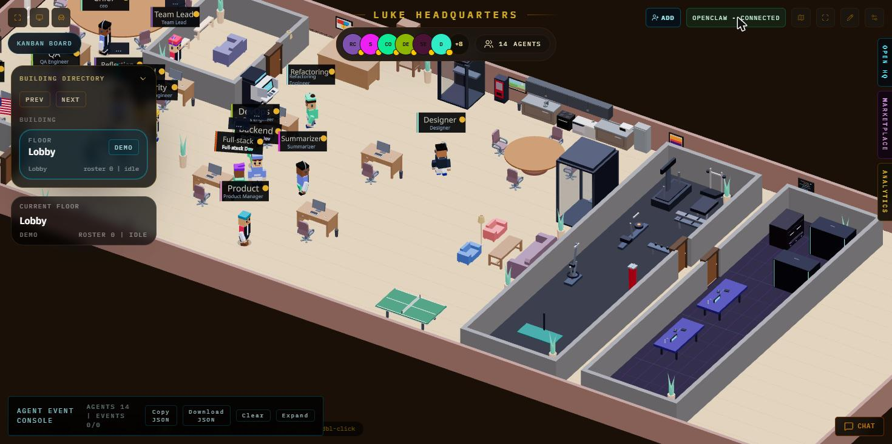

# 🏢 office-agent

**A visual, self-hosted AI software firm you can run in one command.**

`office-agent` wires three pieces together into one turnkey stack:

- **[Paperclip](https://github.com/paperclipai/paperclip)** — the *brain*: agent orchestration, org chart, tasks, budgets, heartbeats.
- **[Claw3D](https://github.com/iamlukethedev/claw3d)** — the *office*: a live 3D workspace where you watch agents work.
- **A bridge + a ready-made IT‑firm team** — so the office shows your *real* Paperclip agents (not a demo), and chatting an agent files a *real* task.

Clone it, run `setup` then `start`, open the office — and a full software team (CEO, CTO, PM, Team Lead, Senior/Frontend/Backend/Full‑stack Engineers, QA, Refactoring, DevOps, Security, Designer) is standing at their desks, ready to work in a continuous loop.

> 📘 **Full step-by-step usage guide** (launch, connect your repos, switch between projects, assign work, Telegram, troubleshooting): **[docs/GUIDE.md](docs/GUIDE.md)**.



---

## ⚡ Quick start

```bash
git clone https://github.com/ShokirjonMK/office-agent.git
cd office-agent
cp .env.example .env        # optional — defaults are fine
./scripts/setup.sh          # clone + install Paperclip & Claw3D, wire the bridge
./scripts/start.sh          # start everything + provision the team
```

Then open:

| What | URL |
|------|-----|
| 🏢 3D office | http://localhost:3000 |
| 📊 Dashboard | http://localhost:3100 |

In the office, click **Connect** (the *OpenClaw* backend and URL `ws://localhost:18789` are pre‑filled), and your team appears on the **OpenClaw Floor**. Open **CHAT**, pick an agent, and send a message — it becomes a real task the agent works on.

Stop everything with `./scripts/stop.sh`. Logs live in `logs/`.

### 🐳 Or with Docker

```bash
git clone https://github.com/ShokirjonMK/office-agent.git
cd office-agent
# give agents Claude auth: either mount ~/.claude (see docker-compose.yml)
# or put ANTHROPIC_API_KEY in a .env file next to compose.
docker compose up -d --build
```

Same URLs (`:3000`, `:3100`). Company/agents/DB persist in the `office_data`
volume. The image bundles Paperclip + Claw3D + the bridge, so it boots straight
into a ready firm.

### Tez boshlash (o'zbekcha)

```bash
git clone https://github.com/ShokirjonMK/office-agent.git
cd office-agent
./scripts/setup.sh     # Paperclip + Claw3D ni klonlab o'rnatadi, ko'prikni ulaydi
./scripts/start.sh     # hammasini ishga tushiradi + jamoani yaratadi
```

`http://localhost:3000` (3D ofis) va `http://localhost:3100` (dashboard) ni oching. Ofisда **Connect** bosing (OpenClaw, URL avtomat to'ladi) → jamoa paydo bo'ladi. **CHAT** dan agentga yozing → haqiqiy task ochiladi. To'xtatish: `./scripts/stop.sh`.

---

## 🧩 What you get

### The team (org chart)

```
CEO
├── CTO
│   ├── Team Lead
│   │   ├── Senior Engineer
│   │   ├── Frontend Dev
│   │   ├── Backend Dev
│   │   ├── Full-stack Dev
│   │   ├── QA Engineer
│   │   └── Refactoring Engineer
│   ├── DevOps Engineer
│   └── Security Engineer
└── Product Manager
    └── Designer
```

Every agent runs on the **Claude Code** local adapter, has a role, a title, a job
description (`capabilities`), and reports to a boss. Edit the roster in
[`scripts/provision.mjs`](scripts/provision.mjs) — it's a plain list.

### How work flows (the loop)

Agents work in a **continuous loop** driven by Paperclip **heartbeats**:

1. You give a goal to the **CEO** or **Product Manager** (office chat or dashboard).
2. Management turns it into issues and **delegates** them down the org chart.
3. On each heartbeat (~30s) every agent **wakes, checks its assigned work, acts,
   and idles** — then repeats. No manual kicking required.
4. QA verifies, Refactoring cleans up, DevOps ships — all as tracked tickets.

You watch it happen live in the 3D office and audit every step in the dashboard.

### Dynamic by design

The bridge polls Paperclip every 5 seconds, so the office reflects reality:

- **Add an agent** (dashboard or `provision.mjs`) → it appears in the office within seconds.
- **Change status / pause / resume** → reflected live.
- **More work → more agents active at once** (delegation + heartbeats run them in parallel).

### Autoscaler (opt-in)

Turn on a **dynamic worker pool** that grows and shrinks with the backlog:

```bash
AUTOSCALE=1 AUTOSCALE_MAX=8 AUTOSCALE_PER_AGENT=3 ./scripts/start.sh
# or set these in .env, or AUTOSCALE=1 in docker-compose
```

Each cycle it counts open (non-terminal) issues and keeps roughly one extra
worker per `AUTOSCALE_PER_AGENT` issues, between `AUTOSCALE_MIN` and
`AUTOSCALE_MAX`. New workers are engineers under the Team Lead, tagged so only
they are managed; idle extras are removed after a cooldown. They appear/disappear
in the 3D office automatically. See [docs/ARCHITECTURE.md](docs/ARCHITECTURE.md).

---

## 🚀 Running a real project

Agents can do real coding work once you point them at a **workspace** (a git repo
or a directory):

1. In the dashboard, open **Projects / Workspaces** and add your repo (path or URL).
2. Assign the goal to the CEO/PM and set the project as the execution workspace.
3. The team works *inside that repo* — branches, edits, tests, PRs — with QA and
   Refactoring in the loop.

Without a workspace, agents still plan and reason, but they won't touch your code.

---

## ⚙️ Configuration

All knobs live in `.env` (see [`.env.example`](.env.example)) and are optional:

| Var | Default | Meaning |
|-----|---------|---------|
| `PAPERCLIP_PORT` | `3100` | Paperclip API + dashboard |
| `CLAW3D_PORT` | `3000` | Claw3D 3D office |
| `GATEWAY_PORT` | `18789` | Paperclip ↔ Claw3D bridge (WebSocket) |
| `COMPANY` | first/new | Target company (UUID, prefix, or name) |
| `HEARTBEAT_MS` | `30000` | Agent loop cadence hint |
| `PAPERCLIP_REF` / `CLAW3D_REF` | pinned | Upstream commits to check out |

---

## 🖥️ Requirements

- **Node.js 20+** (22 recommended)
- **git**, and internet access for the first `setup.sh`
- ~2–3 GB disk for the two upstream repos + dependencies
- A working **Claude Code** login/credentials on the host (the agents use it)

`pnpm@9.15.4` is installed automatically. On **Linux/macOS** nothing else is
needed. On **Windows**, **Git Bash** is required (the setup applies a small patch
so Paperclip's local agents spawn through it — see below).

---

## 🪟 Windows notes

Paperclip's local agent engine writes a bash `.sh` wrapper and assumes a POSIX
host. On Windows, `scripts/apply-windows-patch.mjs` (run automatically by
`setup.sh`) makes it launch that wrapper through **Git Bash**. If Git Bash isn't
at a standard path, set `PAPERCLIP_GIT_BASH` in `.env`. The patch is a no-op on
Linux/macOS.

---

## 🧰 Troubleshooting

| Symptom | Fix |
|---|---|
| Office shows only "Main" / 1 agent | You're on the **Demo** floor. Click the connection chip → **OpenClaw backend** → **Connect**. |
| Office "Disconnected" | The bridge restarted; click **Connect** again (URL is pre‑filled). |
| Agent stuck in `error` | Usually a spawn/login issue. Check `logs/paperclip.log`; clear via the dashboard's *Clear error*. On Windows ensure the patch applied. |
| `pnpm` version error | Paperclip needs exactly `9.15.4`; `setup.sh` pins it. Re-run setup. |
| Nothing at :3100 | See `logs/paperclip.log` — first boot runs DB migrations and can take ~30s. |

---

## 📁 Layout

```
office-agent/
├── bridge/paperclip-gateway-adapter.js   # Paperclip -> Claw3D live bridge
├── scripts/
│   ├── setup.sh                # clone + install + wire + patch
│   ├── start.sh                # run everything + provision (+ optional autoscaler)
│   ├── stop.sh
│   ├── provision.mjs           # create/repair the IT-firm team (idempotent)
│   ├── autoscaler.mjs          # dynamic worker pool (opt-in)
│   └── apply-windows-patch.mjs # Windows-only agent spawn fix
├── Dockerfile · docker-compose.yml · docker/entrypoint.sh
├── docs/ARCHITECTURE.md
├── .env.example
└── vendor/                     # Paperclip & Claw3D (cloned by setup, git-ignored)
```

## 📜 License & credits

MIT. Built on the excellent open‑source
[Paperclip](https://github.com/paperclipai/paperclip) and
[Claw3D](https://github.com/iamlukethedev/claw3d) projects, which retain their
own licenses. This repo adds the bridge, the team, and the one‑command setup.
